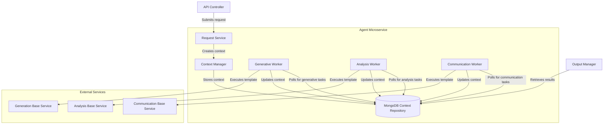
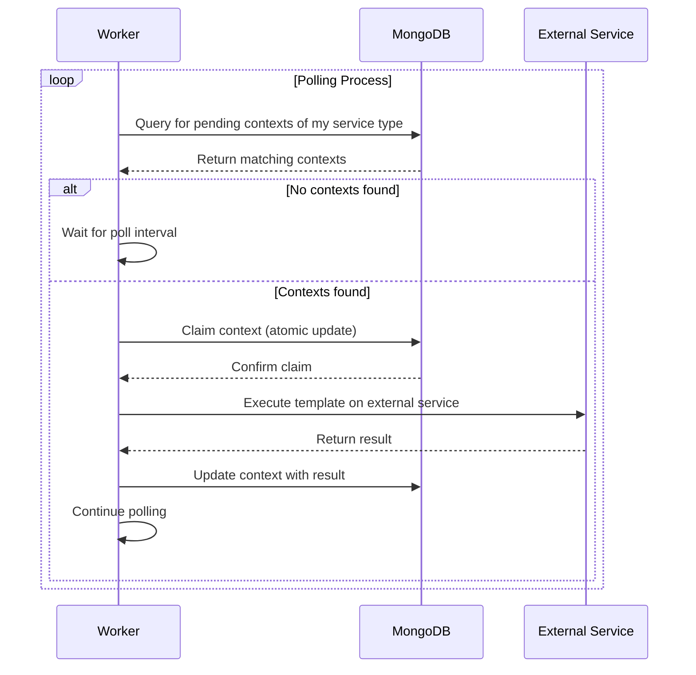

# Agent Microservice Architecture: Worker-Based Execution

This document describes the worker-based execution architecture of the Agent microservice, which has evolved from the previous orchestration-based approach.

## Architecture Overview

The Agent microservice follows a decentralized, worker-based architecture for processing requests. This architecture allows for better separation of concerns, improved scalability, and more efficient task handling.

## Key Components

### Request Service

The Request Service:
- Receives requests from API controllers
- Validates request parameters
- Creates contexts via the Context Manager
- Handles batch operations

### Context Manager

The Context Manager:
- Creates and organizes execution contexts
- Stores contexts in the MongoDB repository
- Manages context persistence and retrieval
- Handles context tagging and organization

### MongoDB Context Repository

The MongoDB Context Repository:
- Stores all execution contexts
- Provides query capabilities for workers
- Maintains execution history
- Supports concurrent access from multiple workers

### Workers

Each worker type:
- Polls the MongoDB repository for relevant tasks
- Claims and processes contexts matching its service type
- Communicates with external services
- Updates context status and results
- Handles errors and retries

Worker types include:
- **Generative Worker**: For text generation and creative tasks
- **Analysis Worker**: For data analysis tasks
- **Communication Worker**: For messaging and notification tasks

## Execution Flow

1. The API Controller receives a request and passes it to the Request Service
2. The Request Service validates the request and creates a context via the Context Manager
3. The Context Manager stores the context in MongoDB with "pending" status
4. Workers continuously poll MongoDB for contexts matching their service type
5. When a worker finds a matching context, it claims it and marks it as "processing"
6. The worker processes the context by communicating with its external service
7. The worker updates the context with results and marks it as "completed" or "failed"
8. The Output Manager retrieves completed contexts when requested

## Worker Processing

Each worker operates independently and follows this processing flow:

## Benefits of Worker-Based Architecture

1. **Decentralized Processing**: 
   - No central orchestration bottleneck
   - Workers operate independently and asynchronously

2. **Improved Scalability**:
   - Each worker type can be scaled independently
   - Resource allocation based on service demand

3. **Better Fault Tolerance**:
   - Failure of one worker doesn't affect others
   - Work can be distributed across multiple instances

4. **Simpler Implementation**:
   - Each worker focuses on a single service type
   - Reduced complexity in request handling

5. **Reduced Latency**:
   - Direct execution without orchestration overhead
   - Parallel processing of different service types

## Configuration

Workers are configured in `main.py` and support these parameters:
- Repository connection
- Service URLs
- Authentication settings
- Polling intervals
- Batch sizes

## Further Information

For implementation details, see:
- [Worker Base Class](../../../src/infrastructure/workers/worker_base.py)
- [Worker Implementations](../../../src/infrastructure/workers/)
- [Context Manager](../../../src/application/services/context_manager.py) 