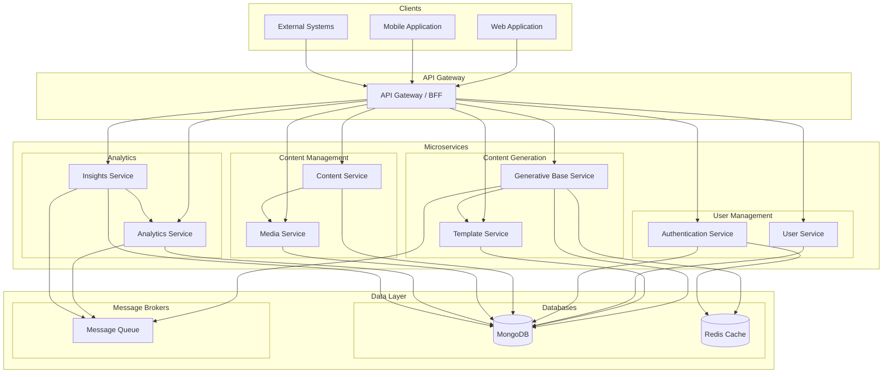
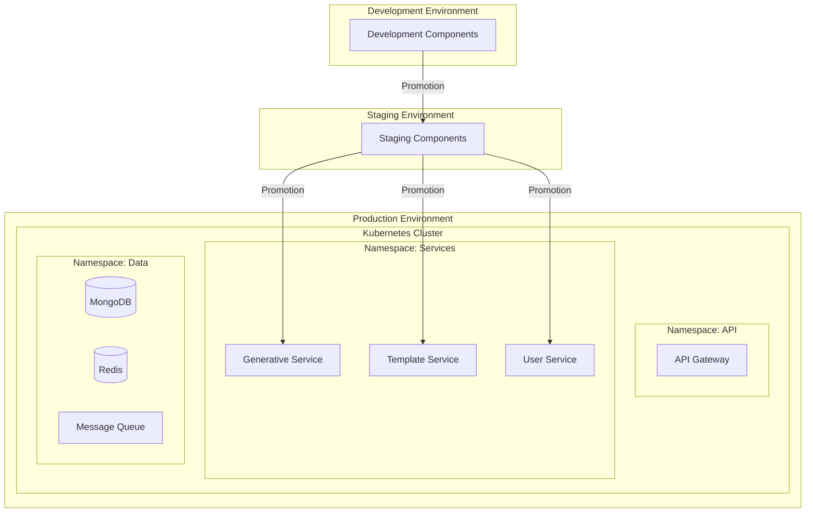

# High-Level Architecture Diagram

## Overview

This document provides a high-level architecture view of our microservices ecosystem, showing how the different services interact within the MACH architecture framework.

## MACH Architecture Principles

Our architecture follows MACH principles:
- **M**icroservices-based: Independent services with focused responsibilities
- **A**PI-first: All services expose and consume standardized APIs
- **C**loud-native: Designed for containerized deployment and scalability
- **H**eadless: Clear separation between frontend and backend concerns

## System Architecture Diagram

## Service Responsibilities

| Service | Primary Responsibility | Key Features |
|---------|------------------------|--------------|
| Generative Base | Process context-based content generation | Component-based pipeline, template processing |
| Template Service | Manage and serve content templates | Template versioning, validation, rendering |
| User Service | Manage user profiles and preferences | User CRUD, preferences, profiles |
| Authentication Service | Handle user authentication and authorization | OAuth, JWT, role-based access |
| Content Service | Manage structured content | Content CRUD, workflows, versioning |
| Media Service | Store and process media assets | Image/video processing, CDN integration |
| Analytics Service | Collect and process analytics data | Event tracking, aggregation, reporting |
| Insights Service | Generate insights from analytics data | ML-based insights, recommendations |

## Communication Patterns

Our microservices employ several communication patterns:

1. **Synchronous REST API Calls**: For immediate request-response needs
2. **Asynchronous Messaging**: For event-driven communication via message queues
3. **Database Integration**: For data-level integration when necessary

## Infrastructure Components

| Component | Purpose | Technology |
|-----------|---------|------------|
| API Gateway | Route and transform API requests | API Gateway (e.g., Kong, AWS API Gateway) |
| MongoDB | Primary data storage | MongoDB Atlas |
| Redis | Caching and temporary storage | Redis |
| Message Queue | Asynchronous communication | RabbitMQ / Kafka |
| Container Orchestration | Manage service instances | Kubernetes |
| Observability | Monitoring and tracing | Prometheus, Jaeger, ELK |

## Deployment View

## Next Steps

For more detailed architecture information, refer to:
- [Component Architecture](02-component-architecture.md)
- [Data Flow Diagram](03-data-flow-diagram.md)
- [Database Schema Documentation](09-database-schema.md) 