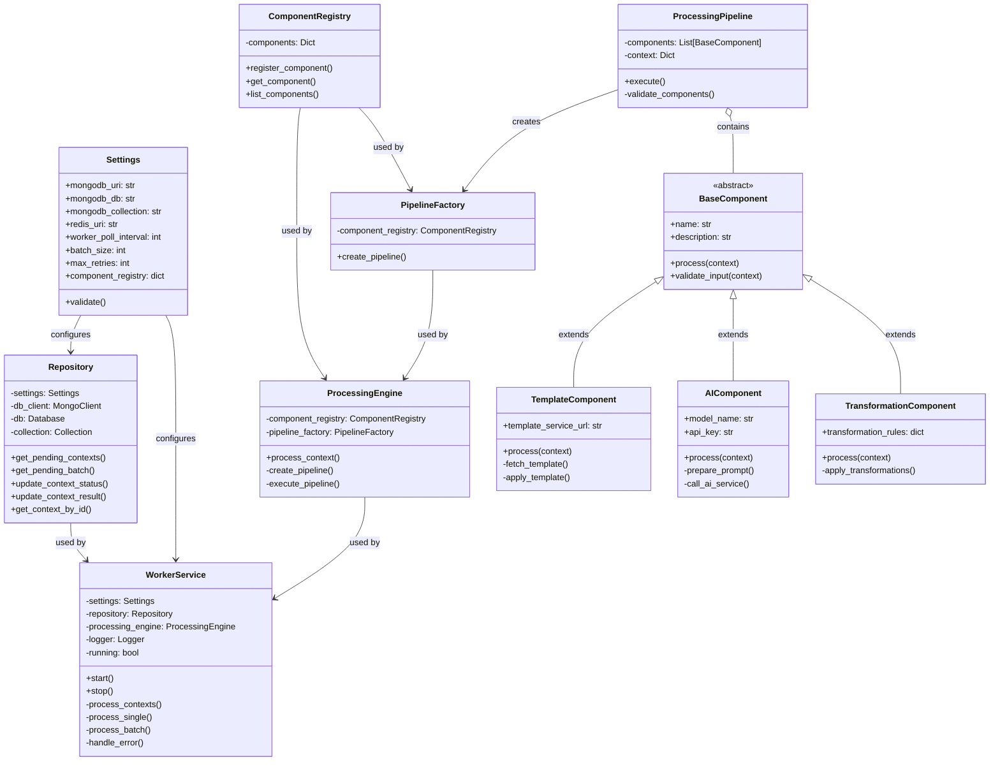
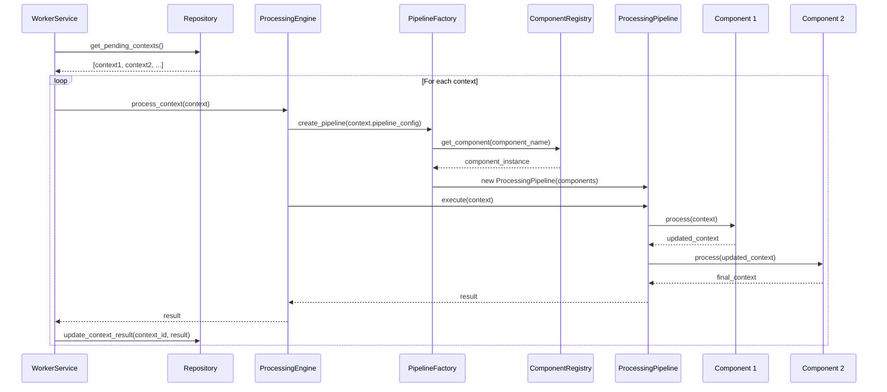

# Component Architecture Diagram

## Overview

This document details the component architecture of our microservices, with a specific focus on the Generative Base Service's internal components and their interactions.

## Component-Based Design Principles

Our component design follows these key principles:

1. **Single Responsibility**: Each component has a clearly defined, focused purpose
2. **Encapsulation**: Components hide internal implementation details
3. **Composability**: Components can be combined in various ways to create complex processing pipelines
4. **Testability**: Components are designed for ease of unit testing
5. **Configurability**: Components can be configured for different use cases

## Generative Base Service Components



## Component Responsibilities

| Component | Responsibility | Key Functionality |
|-----------|----------------|-------------------|
| Settings | Configuration management | Load and validate service configuration |
| Repository | Data access layer | CRUD operations for contexts in MongoDB |
| WorkerService | Main service orchestration | Poll for contexts, manage processing lifecycle |
| ProcessingEngine | Execute processing logic | Coordinate pipeline execution |
| ComponentRegistry | Component management | Register and retrieve components |
| PipelineFactory | Create processing pipelines | Assemble components into pipelines |
| ProcessingPipeline | Pipeline execution | Execute component chain in sequence |
| BaseComponent | Component contract | Define component interface |
| TemplateComponent | Template processing | Fetch and apply content templates |
| AIComponent | AI integration | Call AI services for content generation |
| TransformationComponent | Content transformation | Apply transformations to content |

## Component Interactions

### Context Processing Flow



## Component Configuration

Components are configured through the service settings and context-specific configuration. Example configuration:

```json
{
  "component_registry": {
    "template": {
      "class": "TemplateComponent",
      "config": {
        "template_service_url": "http://template-service:8080/api/templates"
      }
    },
    "ai_generator": {
      "class": "AIComponent",
      "config": {
        "model_name": "gpt-4",
        "temperature": 0.7
      }
    },
    "transformer": {
      "class": "TransformationComponent",
      "config": {
        "transformation_rules": {
          "format": "markdown",
          "max_length": 1000
        }
      }
    }
  }
}
```

## Component Extension

The system is designed for extensibility. New components can be added by:

1. Creating a new class that inherits from `BaseComponent`
2. Implementing the required interface methods
3. Registering the component in the `ComponentRegistry`

## Error Handling

Components implement error handling strategies:

1. Pre-validation of inputs
2. Error capture during processing
3. Standardized error responses
4. Retry mechanisms for transient failures

## Next Steps

For more detailed information, refer to:
- [Data Flow Diagram](03-data-flow-diagram.md)
- [Context Processing Sequence Diagram](04-context-processing-sequence.md)
- [Component Design Pattern Documentation](07-component-design-pattern.md) 