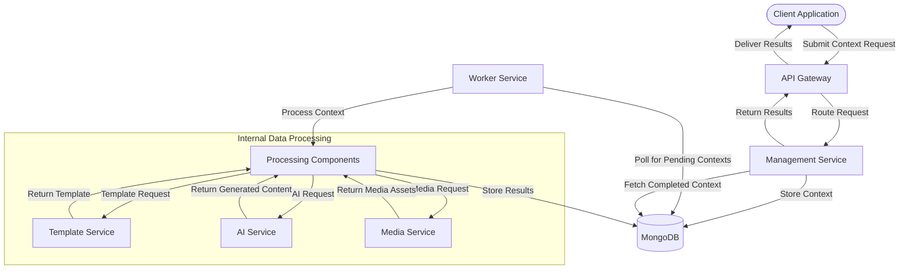
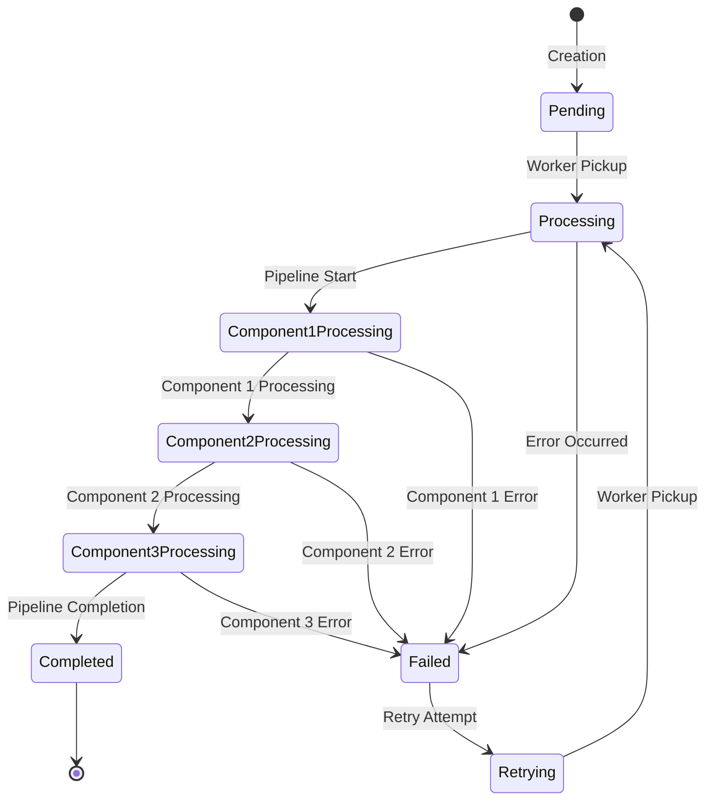
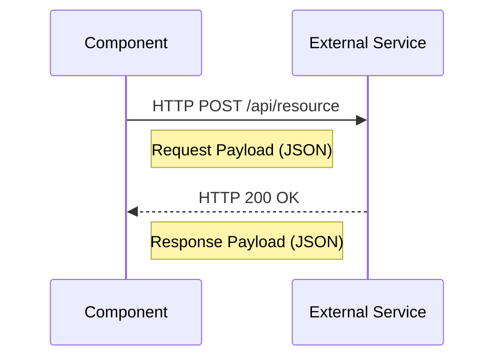

# Data Flow Diagram

## Overview

This document illustrates how data flows through our microservices architecture, focusing on the journey of contexts from creation to completion, including the transformation of data at each stage.

## System Data Flow

The following diagram represents the high-level data flow across our entire system:



## Context Data Lifecycle

The context data undergoes multiple transformations throughout its lifecycle:



## Data Structure Transformations

### Initial Context Request

```json
{
  "id": "ctx_123456",
  "type": "article",
  "status": "pending",
  "pipeline": ["template", "ai_generator", "transformer"],
  "data": {
    "title": "Example Article",
    "keywords": ["microservices", "architecture", "documentation"],
    "target_audience": "developers",
    "tone": "technical"
  },
  "created_at": "2023-05-15T10:30:00Z",
  "updated_at": "2023-05-15T10:30:00Z"
}
```

### After Template Component

```json
{
  "id": "ctx_123456",
  "type": "article",
  "status": "processing",
  "pipeline": ["template", "ai_generator", "transformer"],
  "data": {
    "title": "Example Article",
    "keywords": ["microservices", "architecture", "documentation"],
    "target_audience": "developers",
    "tone": "technical",
    "template": {
      "id": "tmpl_article_technical",
      "sections": [
        {"type": "introduction", "instructions": "Introduce the topic with technical context"},
        {"type": "body", "sections": 3, "instructions": "Cover the main points in detail"},
        {"type": "conclusion", "instructions": "Summarize the key takeaways"}
      ]
    }
  },
  "processing": {
    "current_component": "template",
    "completed_components": ["template"],
    "start_time": "2023-05-15T10:31:00Z"
  },
  "created_at": "2023-05-15T10:30:00Z",
  "updated_at": "2023-05-15T10:31:05Z"
}
```

### After AI Generator Component

```json
{
  "id": "ctx_123456",
  "type": "article",
  "status": "processing",
  "pipeline": ["template", "ai_generator", "transformer"],
  "data": {
    "title": "Example Article",
    "keywords": ["microservices", "architecture", "documentation"],
    "target_audience": "developers",
    "tone": "technical",
    "template": {
      "id": "tmpl_article_technical",
      "sections": [
        {"type": "introduction", "instructions": "Introduce the topic with technical context"},
        {"type": "body", "sections": 3, "instructions": "Cover the main points in detail"},
        {"type": "conclusion", "instructions": "Summarize the key takeaways"}
      ]
    },
    "generated_content": {
      "introduction": "Microservices architecture has revolutionized...",
      "body": [
        {"heading": "Key Principles", "content": "The fundamental principles include..."},
        {"heading": "Implementation Strategies", "content": "When implementing microservices..."},
        {"heading": "Common Challenges", "content": "Organizations often face challenges such as..."}
      ],
      "conclusion": "By following these best practices, developers can..."
    },
    "model_used": "gpt-4",
    "generation_parameters": {
      "temperature": 0.7,
      "max_tokens": 2000
    }
  },
  "processing": {
    "current_component": "ai_generator",
    "completed_components": ["template", "ai_generator"],
    "start_time": "2023-05-15T10:31:00Z"
  },
  "created_at": "2023-05-15T10:30:00Z",
  "updated_at": "2023-05-15T10:32:15Z"
}
```

### Final Transformed Context

```json
{
  "id": "ctx_123456",
  "type": "article",
  "status": "completed",
  "pipeline": ["template", "ai_generator", "transformer"],
  "data": {
    "title": "Example Article",
    "keywords": ["microservices", "architecture", "documentation"],
    "target_audience": "developers",
    "tone": "technical",
    "template": {
      "id": "tmpl_article_technical",
      "sections": [
        {"type": "introduction", "instructions": "Introduce the topic with technical context"},
        {"type": "body", "sections": 3, "instructions": "Cover the main points in detail"},
        {"type": "conclusion", "instructions": "Summarize the key takeaways"}
      ]
    },
    "generated_content": {
      "introduction": "Microservices architecture has revolutionized...",
      "body": [
        {"heading": "Key Principles", "content": "The fundamental principles include..."},
        {"heading": "Implementation Strategies", "content": "When implementing microservices..."},
        {"heading": "Common Challenges", "content": "Organizations often face challenges such as..."}
      ],
      "conclusion": "By following these best practices, developers can..."
    },
    "model_used": "gpt-4",
    "generation_parameters": {
      "temperature": 0.7,
      "max_tokens": 2000
    },
    "formatted_content": {
      "format": "markdown",
      "word_count": 1250,
      "reading_time": "6 minutes",
      "content": "# Example Article\n\n## Introduction\n\nMicroservices architecture has revolutionized...\n\n## Key Principles\n\nThe fundamental principles include...\n\n## Implementation Strategies\n\nWhen implementing microservices...\n\n## Common Challenges\n\nOrganizations often face challenges such as...\n\n## Conclusion\n\nBy following these best practices, developers can..."
    }
  },
  "processing": {
    "completed_components": ["template", "ai_generator", "transformer"],
    "start_time": "2023-05-15T10:31:00Z",
    "end_time": "2023-05-15T10:33:05Z",
    "duration_ms": 125000
  },
  "created_at": "2023-05-15T10:30:00Z",
  "updated_at": "2023-05-15T10:33:05Z"
}
```

## Inter-Service Data Exchange

### Management Service to Worker Service

Data is exchanged primarily through the database, with the Management Service writing context documents and the Worker Service polling for pending contexts.

### Component to External Services

Components communicate with external services using HTTP/REST APIs:



## Data Storage Considerations

### Primary Data Store

MongoDB serves as our primary data store with these collections:

| Collection | Purpose | Key Fields |
|------------|---------|------------|
| contexts | Store all context data | id, status, type, data, processing |
| templates | Store content templates | id, name, structure, version |
| components | Store component configurations | id, name, type, config |
| users | Store user information | id, name, email, permissions |

### Cache Layer

Redis is used for:
- Caching frequently accessed templates
- Storing component registry for quick lookups
- Managing distributed locks for batch processing
- Maintaining worker status and heartbeats

## Data Security

Data is secured through:
1. **Encryption in Transit**: All API calls use HTTPS
2. **Encryption at Rest**: Database encryption for sensitive fields
3. **Access Control**: Role-based access to data
4. **Auditing**: Data access logs for sensitive operations

## Next Steps

For more detailed information, refer to:
- [Context Processing Sequence Diagram](04-context-processing-sequence.md)
- [Batch Processing Flow Diagram](05-batch-processing-flow.md)
- [Database Schema Documentation](09-database-schema.md) 