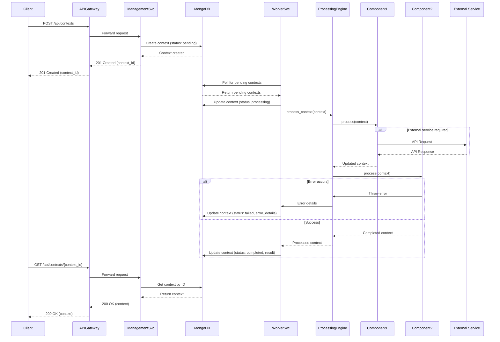
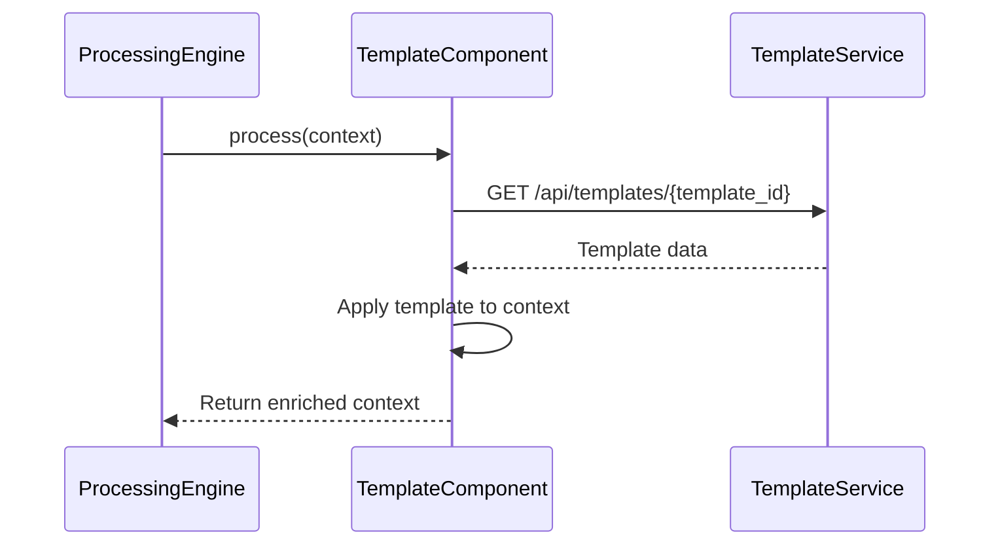
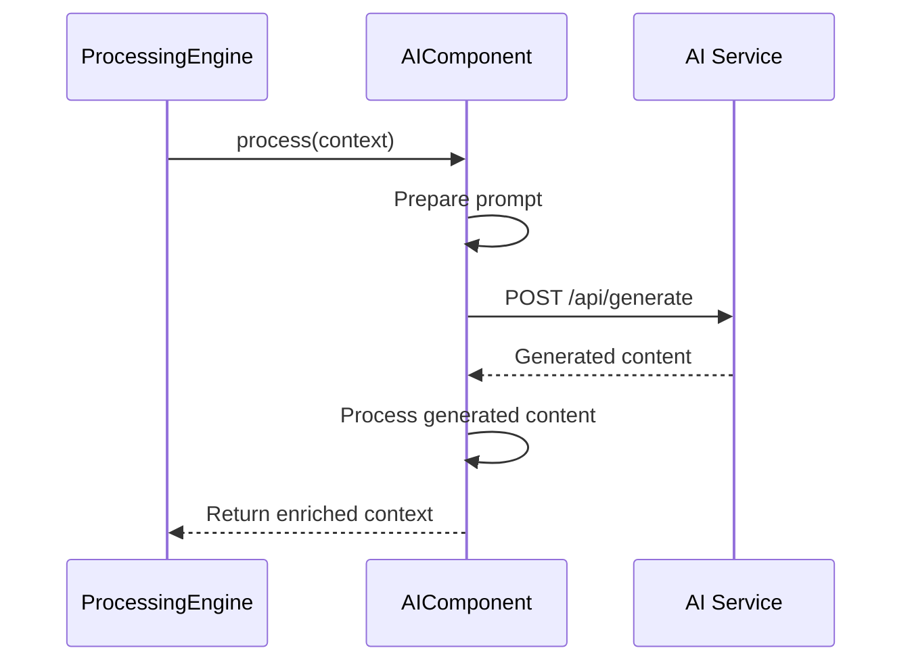
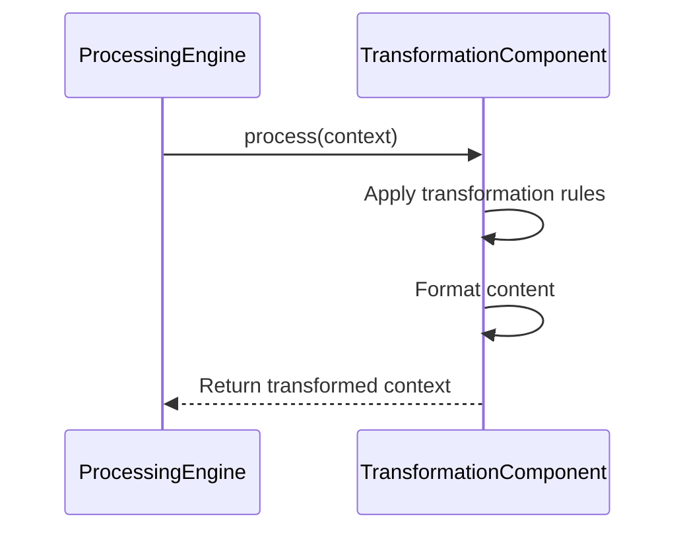
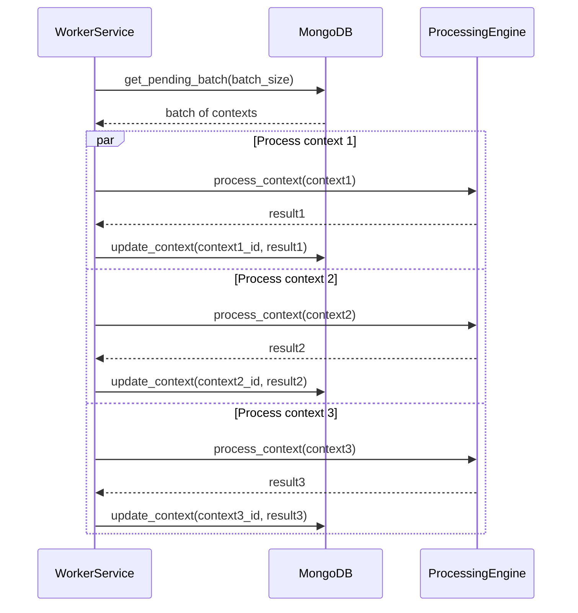
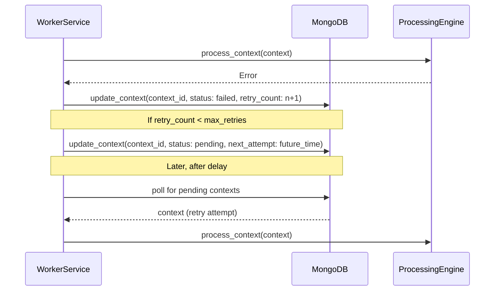
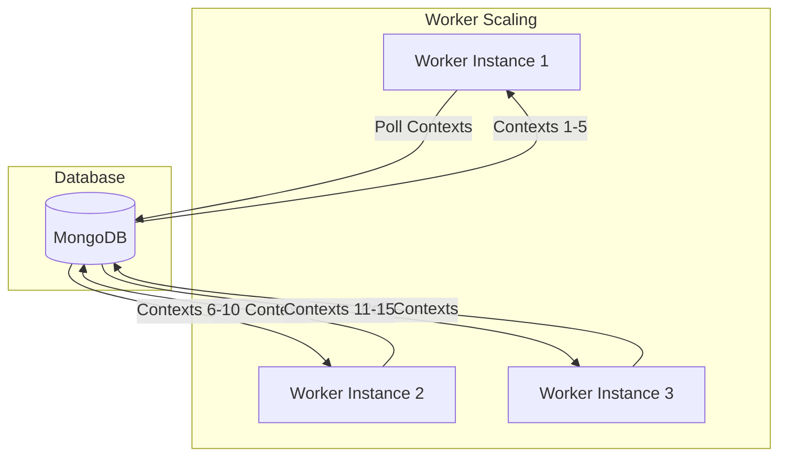

# Context Processing Sequence Diagram

## Overview

This document details the sequence of operations involved in processing a context through the system, from initial request to completion. It focuses on the interaction between components, services, and data stores during the context lifecycle.

## Context Processing Sequence

## Detailed Process Steps

### 1. Context Creation

1. Client submits a new context processing request to the API Gateway
2. The request is routed to the Management Service
3. The Management Service creates a new context document in MongoDB with status "pending"
4. The context ID is returned to the client for later status checking

### 2. Worker Processing

1. The Worker Service periodically polls MongoDB for contexts with "pending" status
2. When pending contexts are found, the Worker updates their status to "processing"
3. The Worker Service invokes the Processing Engine to handle the context
4. The Processing Engine creates a pipeline based on the context's configuration
5. The Processing Engine executes the pipeline, invoking each component in sequence

### 3. Component Processing

1. Each component receives the context document with accumulated changes
2. Components may make external API calls to services like Template Service or AI Service
3. Components transform the context data according to their specific responsibilities
4. Components may enrich the context with additional data
5. Components pass the enriched context to the next component in the pipeline

### 4. Error Handling

If an error occurs during processing:
1. The component throws an error with details about the failure
2. The Processing Engine catches the error and forwards it to the Worker Service
3. The Worker Service updates the context with status "failed" and includes error details
4. Depending on configuration, the Worker Service may schedule a retry

### 5. Result Delivery

1. Upon successful processing, the Worker Service updates the context status to "completed"
2. The processed result is stored in the context document
3. The client can retrieve the context using the context ID
4. The Management Service returns the completed context with processing results

## Component-Specific Processing Flows

### Template Component

### AI Generator Component

### Transformation Component

## Batch Processing Sequence

The batch processing workflow involves handling multiple contexts simultaneously:

## Retry Mechanism

When a processing failure occurs, the retry mechanism works as follows:

## System Behavior Under Load

During high load conditions, the system scales as follows:

## Next Steps

For more detailed information, refer to:
- [Batch Processing Flow Diagram](05-batch-processing-flow.md)
- [Processing Optimization Documentation](06-processing-optimization.md)
- [Component Design Pattern Documentation](07-component-design-pattern.md)
- [Scaling Strategy Documentation](08-scaling-strategy.md) 