# Batch Processing Flow Diagram

## Overview

This document details the batch processing capabilities of our system, focusing on how multiple contexts are processed simultaneously to optimize throughput and resource utilization.

## Batch Processing Architecture

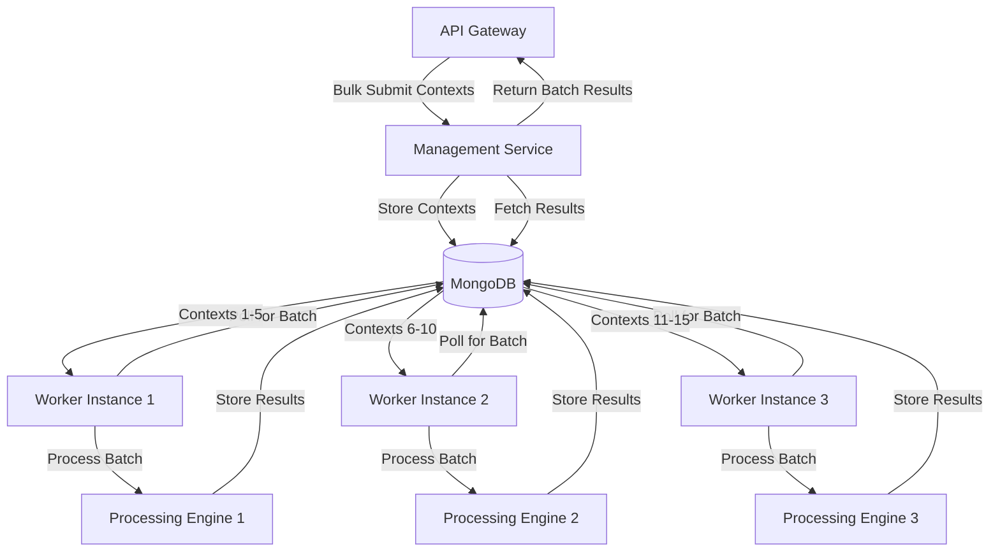

## Batch Processing Strategies

### 1. Fixed-Size Batch Processing

The system processes contexts in fixed-size batches:

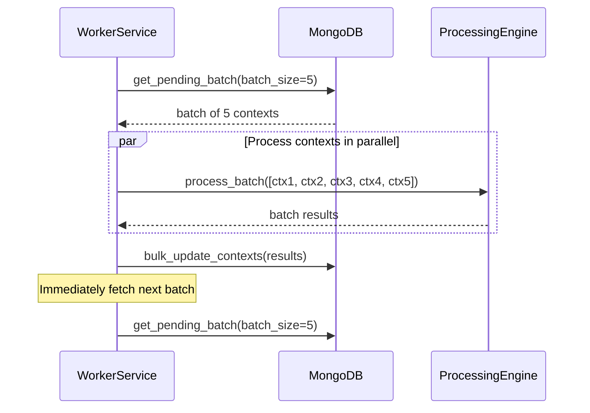

### 2. Dynamic Batch Sizing

The system adjusts batch sizes based on system load and available resources:

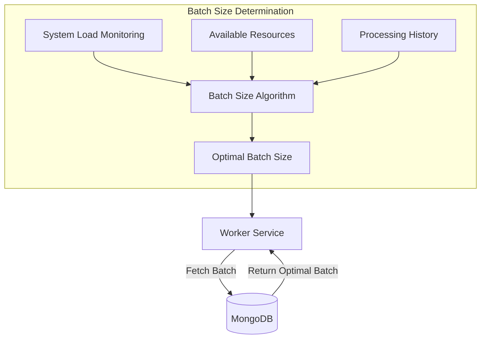

### 3. Priority-Based Batching

Contexts are batched based on priority levels:

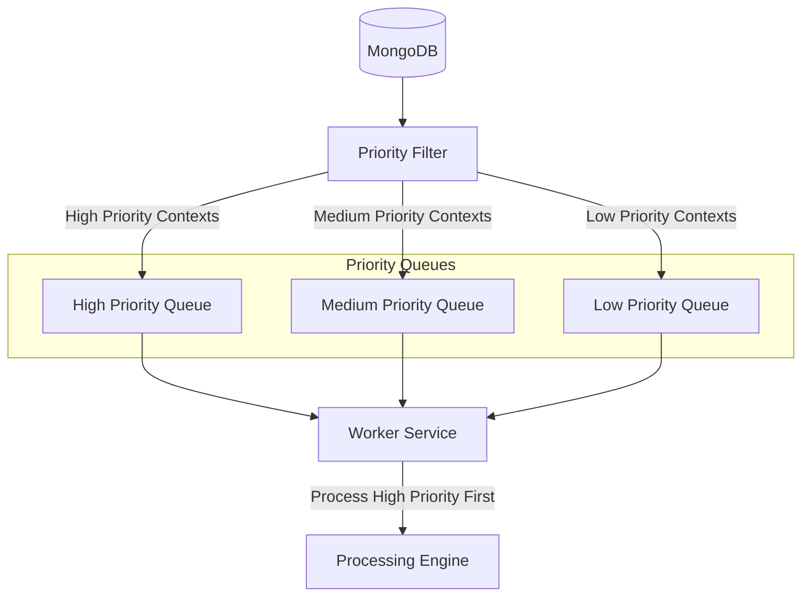

## Batch Processing Flow

### Client Bulk Submission Flow

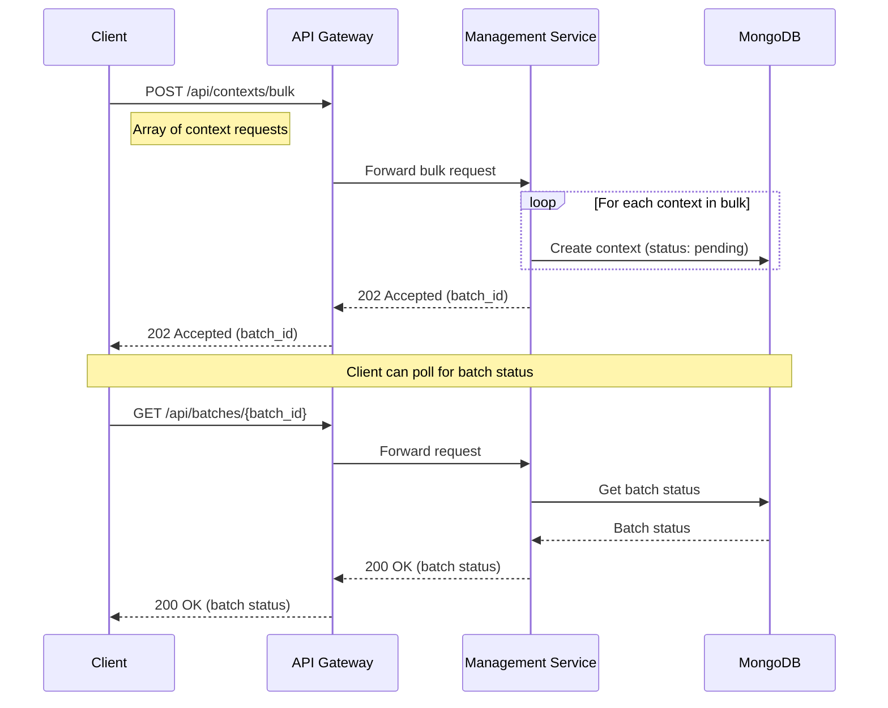

### Worker Batch Processing Flow

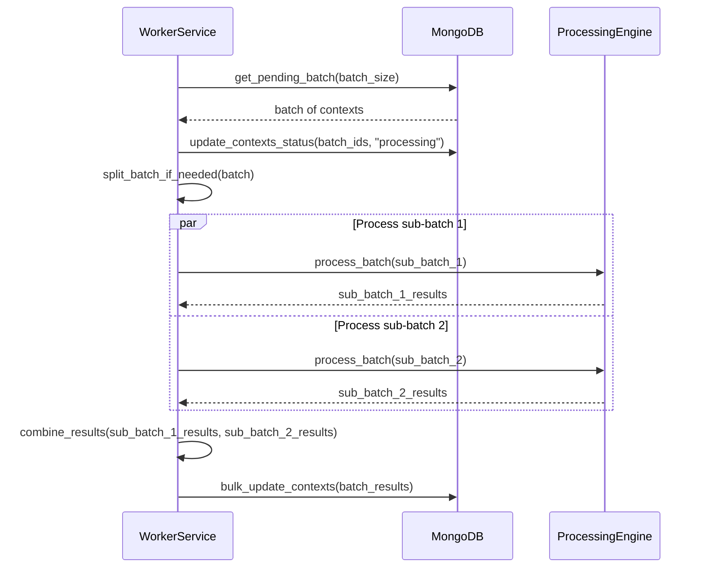

## Batch Processing Performance

### Throughput Optimization

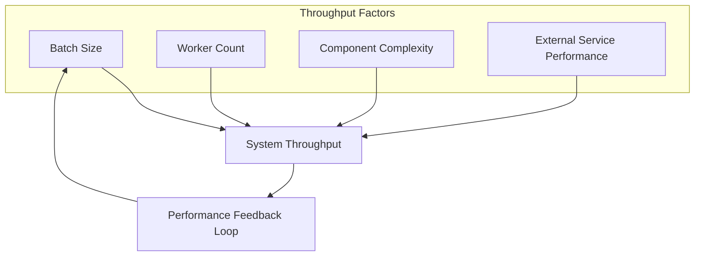

### Resource Utilization

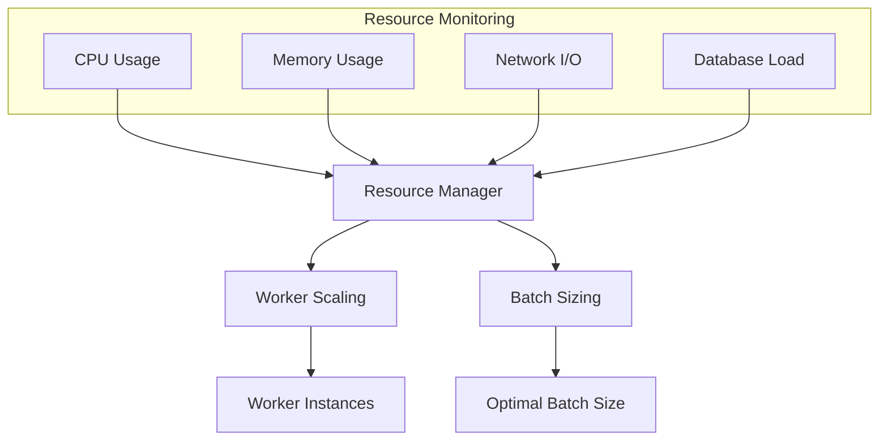

## Error Handling in Batch Processing

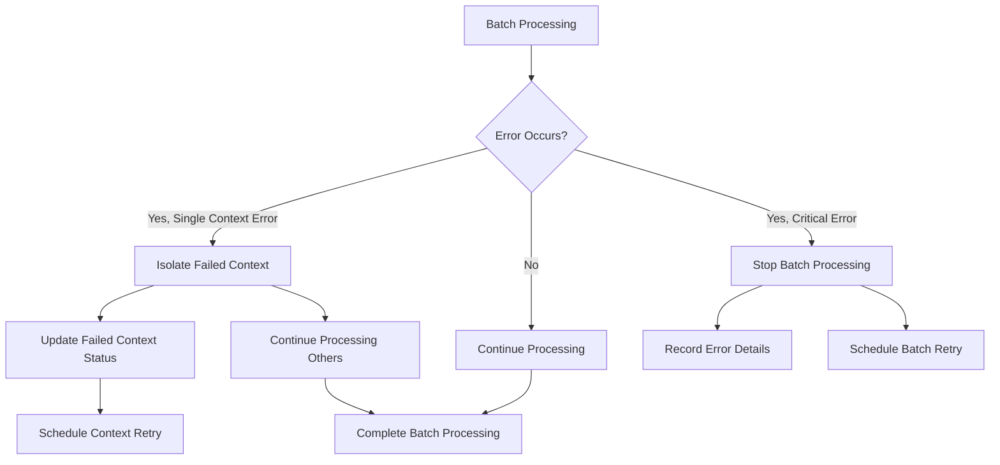

## Distributed Batch Processing

For high-scale operations, the system distributes batches across multiple worker nodes:

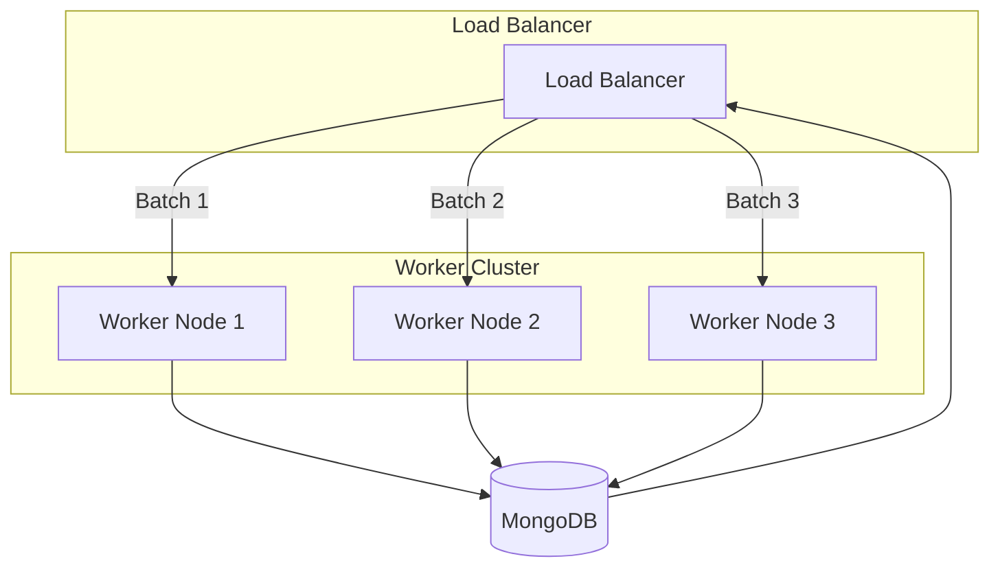

## Batch Processing Monitoring

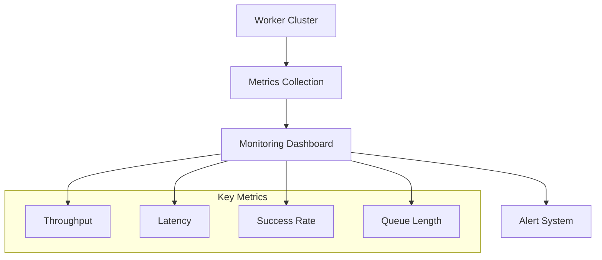

## Batch Processing Configuration

The batch processing behavior is configurable through various settings:

```yaml
worker:
  batch_size: 10                      # Number of contexts per batch
  max_parallel_batches: 3             # Maximum concurrent batches per worker
  dynamic_batch_sizing: true          # Enable dynamic batch sizing
  min_batch_size: 5                   # Minimum batch size for dynamic sizing
  max_batch_size: 20                  # Maximum batch size for dynamic sizing
  batch_timeout_seconds: 60           # Maximum time to wait for a full batch
  
  priorities:
    enabled: true                     # Enable priority-based processing
    levels:
      high: 0-10                      # Priority value ranges
      medium: 11-50
      low: 51-100
      
  retry:
    batch_retries: 3                  # Maximum batch retry attempts
    backoff_seconds: [5, 15, 30]      # Retry backoff periods
```

## Next Steps

For more detailed information, refer to:
- [Processing Optimization Documentation](06-processing-optimization.md)
- [Component Design Pattern Documentation](07-component-design-pattern.md)
- [Scaling Strategy Documentation](08-scaling-strategy.md)
- [Database Schema Documentation](09-database-schema.md) 