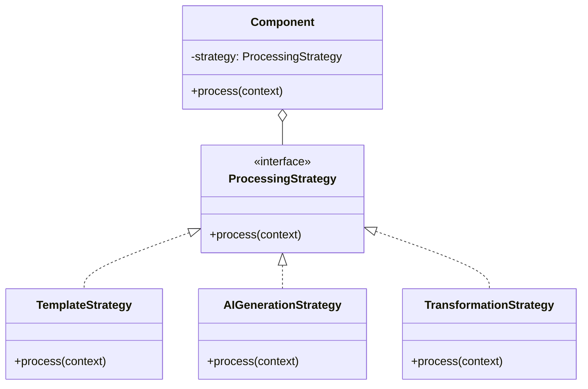
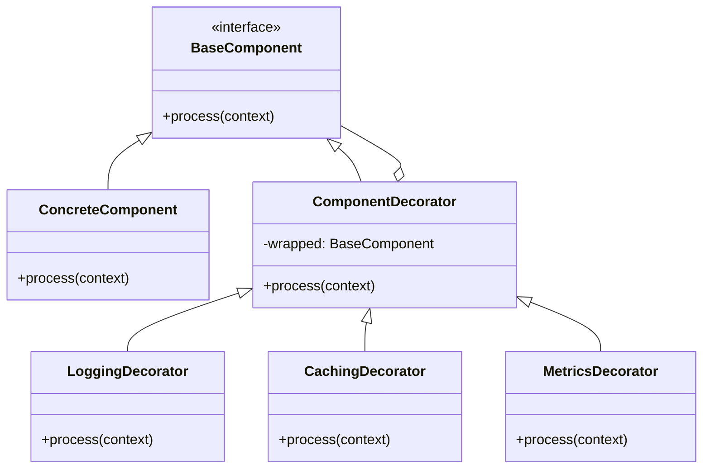
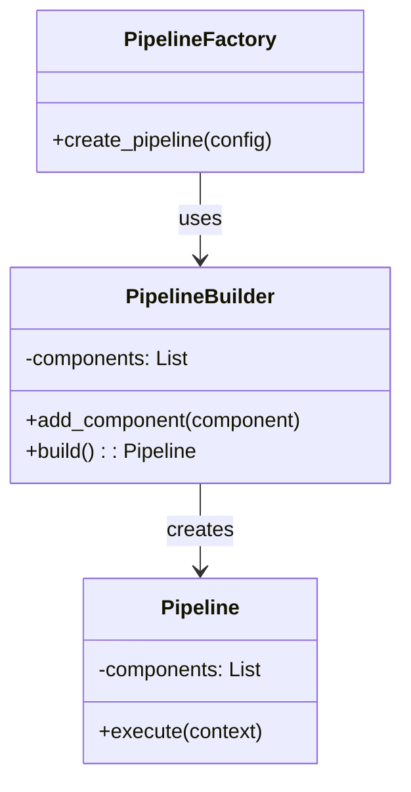
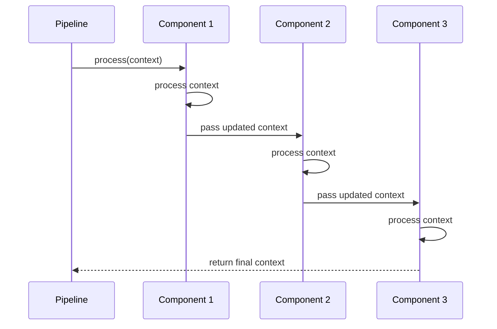
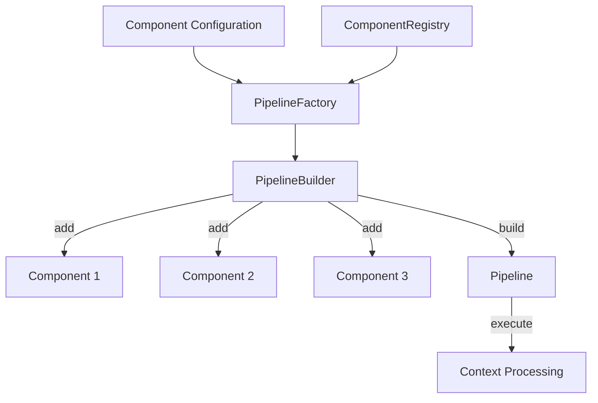

# Component Design Pattern Documentation

## Overview

This document outlines the design patterns and principles used in our component-based architecture, with a focus on how components are designed, composed, and extended within the generative service.

## Component-Based Architecture Principles

Our component architecture is built on the following core principles:

1. **Single Responsibility**: Each component has a well-defined, focused purpose
2. **Pluggability**: Components can be added, removed, or replaced without affecting the overall system
3. **Composability**: Components can be combined into pipelines to create complex workflows
4. **Testability**: Components are designed for easy unit testing and mocking
5. **Configuration-Driven**: Components are configured rather than modified for different use cases

## Component Interface

All components implement a common interface:

```python
class BaseComponent(ABC):
    """Base class for all processing components."""
    
    def __init__(self, name: str, config: Dict[str, Any]):
        self.name = name
        self.config = config
        self.logger = structlog.get_logger(component=name)
        self.validate_config()
    
    @abstractmethod
    def process(self, context: Dict[str, Any]) -> Dict[str, Any]:
        """Process the context and return the updated context."""
        pass
    
    @abstractmethod
    def validate_config(self) -> None:
        """Validate the component configuration."""
        pass
    
    def validate_input(self, context: Dict[str, Any]) -> None:
        """Validate the input context before processing."""
        pass
    
    def handle_error(self, context: Dict[str, Any], error: Exception) -> Dict[str, Any]:
        """Handle component-specific errors during processing."""
        self.logger.error("Error processing context", 
                         context_id=context.get("id"), 
                         error=str(error))
        raise error
```

## Component Design Patterns

### 1. Strategy Pattern

The component system uses the Strategy pattern to encapsulate different processing algorithms:



### 2. Decorator Pattern

Components can be decorated to add cross-cutting concerns:



### 3. Builder Pattern

The Pipeline Factory uses a Builder pattern to construct processing pipelines:



### 4. Chain of Responsibility

Components form a chain of responsibility within a pipeline:



### 5. Factory Method Pattern

The ComponentRegistry uses a Factory Method pattern to create components:

```python
class ComponentRegistry:
    """Registry for component types and factories."""
    
    def __init__(self):
        self.component_factories = {}
    
    def register_component_type(self, component_type: str, factory_func: Callable):
        """Register a component factory function for a component type."""
        self.component_factories[component_type] = factory_func
    
    def create_component(self, component_type: str, name: str, config: Dict[str, Any]) -> BaseComponent:
        """Create a component of the specified type with the given configuration."""
        if component_type not in self.component_factories:
            raise ValueError(f"Unknown component type: {component_type}")
        
        factory_func = self.component_factories[component_type]
        return factory_func(name, config)
```

## Component Composition

### Pipeline Construction



### Component Configuration

Components are configured through a declarative configuration format:

```json
{
  "pipeline": {
    "name": "article_generation_pipeline",
    "components": [
      {
        "type": "template",
        "name": "article_template",
        "config": {
          "template_service_url": "http://template-service:8080/api/templates",
          "template_type": "article",
          "timeout_seconds": 5
        }
      },
      {
        "type": "ai_generator",
        "name": "article_generator",
        "config": {
          "model": "gpt-4",
          "temperature": 0.7,
          "max_tokens": 2000,
          "top_p": 1.0
        }
      },
      {
        "type": "transformer",
        "name": "markdown_transformer",
        "config": {
          "output_format": "markdown",
          "add_table_of_contents": true,
          "max_heading_level": 3
        }
      }
    ]
  }
}
```

## Component Extension

### Creating a New Component

To create a new component:

1. Create a new class that inherits from `BaseComponent`
2. Implement the required methods (`process`, `validate_config`)
3. Register the component factory with the `ComponentRegistry`

```python
class MyCustomComponent(BaseComponent):
    """A custom component that performs specific processing."""
    
    def validate_config(self) -> None:
        """Validate component configuration."""
        required_fields = ["field1", "field2"]
        for field in required_fields:
            if field not in self.config:
                raise ValueError(f"Missing required configuration field: {field}")
    
    def process(self, context: Dict[str, Any]) -> Dict[str, Any]:
        """Process the context and return the updated context."""
        self.validate_input(context)
        
        # Component-specific processing logic
        field1_value = self.config["field1"]
        field2_value = self.config["field2"]
        
        # Modify the context
        processed_context = context.copy()
        processed_context["data"]["my_custom_field"] = process_data(
            context["data"]["input_field"],
            field1_value,
            field2_value
        )
        
        return processed_context
    
    def validate_input(self, context: Dict[str, Any]) -> None:
        """Validate that the context has required fields."""
        if "data" not in context:
            raise ValueError("Context missing 'data' field")
        if "input_field" not in context["data"]:
            raise ValueError("Context missing 'data.input_field'")

# Register the component factory
def create_my_custom_component(name: str, config: Dict[str, Any]) -> BaseComponent:
    return MyCustomComponent(name, config)

component_registry.register_component_type("my_custom", create_my_custom_component)
```

## Component Testing

### Unit Testing Components

Components are designed for easy unit testing:

```python
def test_custom_component():
    # Arrange
    config = {
        "field1": "value1",
        "field2": "value2"
    }
    component = MyCustomComponent("test_component", config)
    context = {
        "id": "ctx_123",
        "data": {
            "input_field": "test input"
        }
    }
    
    # Act
    result = component.process(context)
    
    # Assert
    assert "my_custom_field" in result["data"]
    assert result["data"]["my_custom_field"] == expected_output
```

### Mock Testing with External Services

For components that interact with external services:

```python
@patch("my_module.requests.post")
def test_ai_component_with_mock(mock_post):
    # Arrange
    mock_response = MagicMock()
    mock_response.status_code = 200
    mock_response.json.return_value = {
        "generated_text": "This is generated content"
    }
    mock_post.return_value = mock_response
    
    config = {
        "api_url": "https://ai-service.example.com/api/generate",
        "model": "gpt-4"
    }
    component = AIComponent("test_ai", config)
    context = {
        "id": "ctx_123",
        "data": {
            "prompt": "Generate something"
        }
    }
    
    # Act
    result = component.process(context)
    
    # Assert
    assert "generated_content" in result["data"]
    assert result["data"]["generated_content"] == "This is generated content"
    mock_post.assert_called_once()
```

## Component Best Practices

### 1. Keep Components Focused

Components should have a single responsibility and do it well:

```python
# Good - Focused component
class TextFormattingComponent(BaseComponent):
    def process(self, context):
        # Only handles text formatting
        return format_text(context)

# Avoid - Too many responsibilities
class TextProcessingComponent(BaseComponent):
    def process(self, context):
        # Handles multiple responsibilities
        context = translate_text(context)
        context = format_text(context)
        context = spell_check(context)
        return context
```

### 2. Design for Composition

Components should be designed to work together in a pipeline:

```python
# Each component handles a specific part of the process
translation_component = TranslationComponent(...)
formatting_component = FormattingComponent(...)
spell_check_component = SpellCheckComponent(...)

# Components are composed into a pipeline
pipeline = Pipeline([
    translation_component,
    formatting_component,
    spell_check_component
])
```

### 3. Make Components Stateless

Components should be stateless to ensure they can be safely used in parallel:

```python
# Good - Stateless component
class StatelessComponent(BaseComponent):
    def process(self, context):
        # All needed information comes from context or config
        result = process_data(context["data"], self.config)
        return update_context(context, result)

# Avoid - Stateful component
class StatefulComponent(BaseComponent):
    def __init__(self, name, config):
        super().__init__(name, config)
        self.state = {}
    
    def process(self, context):
        # Uses and updates internal state
        self.state[context["id"]] = compute_state(context)
        return process_with_state(context, self.state)
```

### 4. Handle Errors Gracefully

Components should handle errors and provide informative error messages:

```python
def process(self, context):
    try:
        # Processing logic
        return processed_context
    except ApiError as e:
        self.logger.error("API call failed", 
                         context_id=context.get("id"),
                         error=str(e))
        raise ComponentError(f"External API call failed: {str(e)}")
    except ValueError as e:
        self.logger.error("Invalid data format", 
                         context_id=context.get("id"),
                         error=str(e))
        raise ComponentError(f"Invalid data format: {str(e)}")
```

## Next Steps

For more detailed information, refer to:
- [Processing Optimization Documentation](06-processing-optimization.md)
- [Scaling Strategy Documentation](08-scaling-strategy.md)
- [Database Schema Documentation](09-database-schema.md)
- [API Documentation](10-api-documentation.md) 