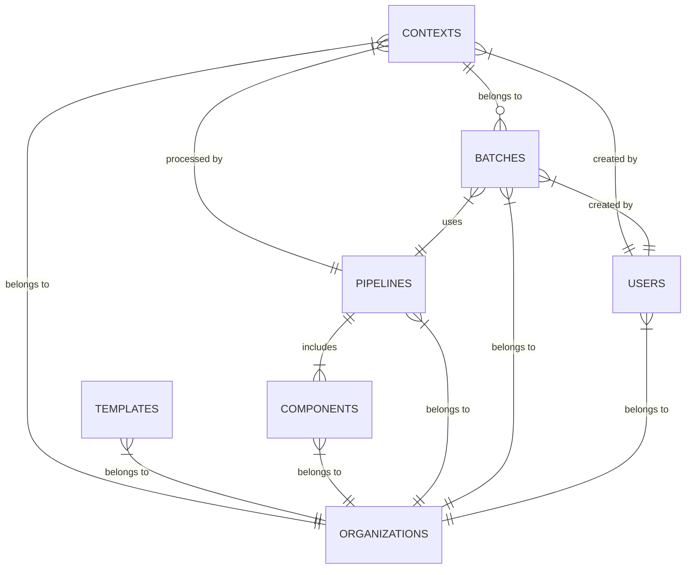
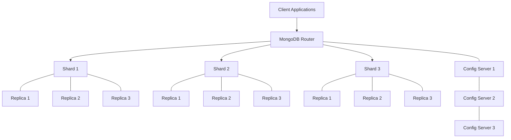

# Database Schema Documentation

## Overview

This document details the database schema used throughout our microservices architecture, with a focus on the MongoDB collections used by the generative service. It outlines the structure, relationships, and indexing strategies to ensure optimal performance.

## MongoDB Schema

Our system primarily uses MongoDB as the document store for its flexibility and scalability in handling diverse content structures.

### Core Collections

#### Contexts Collection

The `contexts` collection stores all context documents used in content generation:

```json
{
  "_id": "ctx_123456",
  "type": "article",
  "status": "completed",
  "created_at": "2023-06-10T14:30:00Z",
  "updated_at": "2023-06-10T14:35:23Z",
  "pipeline": ["template", "ai_generator", "transformer"],
  "data": {
    "title": "Example Article",
    "keywords": ["microservices", "architecture", "documentation"],
    "target_audience": "developers",
    "tone": "technical",
    "template": {
      "id": "tmpl_article_technical",
      "sections": [/* template structure */]
    },
    "generated_content": {
      "introduction": "Microservices architecture has revolutionized...",
      "body": [/* generated sections */],
      "conclusion": "By following these best practices, developers can..."
    },
    "formatted_content": {
      "format": "markdown",
      "content": "# Example Article\n\n## Introduction\n\n..."
    }
  },
  "processing": {
    "started_at": "2023-06-10T14:30:05Z",
    "completed_at": "2023-06-10T14:35:20Z",
    "duration_ms": 312500,
    "completed_components": ["template", "ai_generator", "transformer"],
    "component_timings": {
      "template": 150,
      "ai_generator": 10200,
      "transformer": 350
    }
  },
  "error": null,
  "retry_count": 0,
  "next_retry_at": null,
  "batch_id": "batch_7890",
  "user_id": "user_456",
  "organization_id": "org_123",
  "metadata": {
    "source": "api",
    "client_version": "1.2.3",
    "priority": 5
  }
}
```

#### Templates Collection

The `templates` collection stores reusable content templates:

```json
{
  "_id": "tmpl_article_technical",
  "name": "Technical Article Template",
  "description": "Template for technical articles with structured sections",
  "version": "1.3.0",
  "created_at": "2023-01-15T09:00:00Z",
  "updated_at": "2023-05-20T11:45:30Z",
  "created_by": "user_789",
  "structure": {
    "sections": [
      {
        "id": "introduction",
        "type": "text",
        "name": "Introduction",
        "instructions": "Provide a technical introduction to the topic",
        "word_range": [150, 300]
      },
      {
        "id": "main_content",
        "type": "sections",
        "name": "Main Content",
        "min_sections": 2,
        "max_sections": 5,
        "section_template": {
          "type": "text",
          "instructions": "Expand on a specific aspect of the topic",
          "word_range": [300, 600]
        }
      },
      {
        "id": "conclusion",
        "type": "text",
        "name": "Conclusion",
        "instructions": "Summarize key points and provide next steps",
        "word_range": [150, 300]
      }
    ]
  },
  "metadata": {
    "tags": ["technical", "article", "documentation"],
    "category": "educational",
    "target_audience": "developers"
  },
  "is_active": true,
  "organization_id": "org_123"
}
```

#### Components Collection

The `components` collection stores component configurations:

```json
{
  "_id": "comp_ai_generator_gpt4",
  "name": "GPT-4 Article Generator",
  "type": "ai_generator",
  "description": "AI generator component using GPT-4 for article generation",
  "created_at": "2023-02-10T15:20:00Z",
  "updated_at": "2023-06-01T09:15:45Z",
  "created_by": "user_789",
  "config": {
    "model": "gpt-4",
    "temperature": 0.7,
    "max_tokens": 2000,
    "top_p": 1.0,
    "frequency_penalty": 0.1,
    "presence_penalty": 0.1,
    "stop_sequences": ["\n\n\n"]
  },
  "metadata": {
    "version": "1.0.5",
    "input_format": "template_with_instructions",
    "output_format": "structured_json",
    "cost_per_1k_tokens": 0.06
  },
  "is_active": true,
  "organization_id": "org_123"
}
```

#### Pipelines Collection

The `pipelines` collection stores predefined processing pipelines:

```json
{
  "_id": "pipe_article_generation",
  "name": "Article Generation Pipeline",
  "description": "Pipeline for generating technical articles",
  "created_at": "2023-03-05T13:10:00Z",
  "updated_at": "2023-06-15T10:30:20Z",
  "created_by": "user_789",
  "components": [
    {
      "component_id": "comp_template_article",
      "name": "Article Template",
      "order": 1,
      "config_overrides": {
        "template_id": "tmpl_article_technical"
      }
    },
    {
      "component_id": "comp_ai_generator_gpt4",
      "name": "GPT-4 Generator",
      "order": 2,
      "config_overrides": {
        "temperature": 0.65
      }
    },
    {
      "component_id": "comp_transformer_markdown",
      "name": "Markdown Transformer",
      "order": 3,
      "config_overrides": {
        "add_table_of_contents": true
      }
    }
  ],
  "default_context_type": "article",
  "metadata": {
    "estimated_processing_time_ms": 12000,
    "success_rate": 0.98,
    "average_tokens": 1500
  },
  "is_active": true,
  "organization_id": "org_123"
}
```

#### Batches Collection

The `batches` collection tracks batches of contexts:

```json
{
  "_id": "batch_7890",
  "name": "Daily Article Batch",
  "description": "Batch of technical articles for daily publication",
  "created_at": "2023-06-10T14:00:00Z",
  "updated_at": "2023-06-10T14:45:30Z",
  "created_by": "user_456",
  "status": "completed",
  "context_ids": ["ctx_123456", "ctx_123457", "ctx_123458"],
  "context_count": 3,
  "completed_count": 3,
  "failed_count": 0,
  "processing_started_at": "2023-06-10T14:00:05Z",
  "processing_completed_at": "2023-06-10T14:45:25Z",
  "total_duration_ms": 2720000,
  "pipeline_id": "pipe_article_generation",
  "metadata": {
    "priority": 5,
    "source": "scheduled"
  },
  "organization_id": "org_123"
}
```

### Supporting Collections

#### Users Collection

```json
{
  "_id": "user_456",
  "email": "user@example.com",
  "name": "John Doe",
  "created_at": "2022-11-05T09:20:00Z",
  "updated_at": "2023-06-01T15:45:30Z",
  "last_login_at": "2023-06-10T14:00:00Z",
  "role": "admin",
  "status": "active",
  "preferences": {
    "language": "en",
    "timezone": "UTC",
    "notifications": {
      "email": true,
      "slack": false
    }
  },
  "api_keys": [
    {
      "key_id": "key_abc123",
      "name": "Production API Key",
      "created_at": "2023-01-10T11:30:00Z",
      "last_used_at": "2023-06-10T14:00:00Z",
      "permissions": ["read", "write"]
    }
  ],
  "organization_id": "org_123"
}
```

#### Organizations Collection

```json
{
  "_id": "org_123",
  "name": "Acme Corporation",
  "created_at": "2022-10-01T10:00:00Z",
  "updated_at": "2023-06-01T09:15:00Z",
  "plan": "enterprise",
  "settings": {
    "max_contexts_per_day": 1000,
    "max_batch_size": 50,
    "allowed_models": ["gpt-3.5-turbo", "gpt-4"],
    "default_pipeline_id": "pipe_article_generation"
  },
  "contacts": [
    {
      "name": "Jane Smith",
      "email": "jane@acme.com",
      "role": "Admin"
    }
  ],
  "billing": {
    "plan_renewal_date": "2024-06-01T00:00:00Z",
    "payment_method": "credit_card",
    "billing_email": "billing@acme.com"
  }
}
```

## Indexing Strategy

### Contexts Collection Indexes

```javascript
// Create indexes for the contexts collection
db.contexts.createIndex({ "status": 1, "created_at": 1 })  // For worker polling
db.contexts.createIndex({ "batch_id": 1 })                // For batch operations
db.contexts.createIndex({ "user_id": 1 })                 // For user-based queries
db.contexts.createIndex({ "organization_id": 1 })         // For organization-based queries
db.contexts.createIndex({ "type": 1 })                    // For filtering by type
db.contexts.createIndex({ 
  "metadata.priority": 1, 
  "status": 1, 
  "created_at": 1 
})                                                        // For priority-based polling
```

### Templates Collection Indexes

```javascript
// Create indexes for the templates collection
db.templates.createIndex({ "organization_id": 1 })        // For organization-based queries
db.templates.createIndex({ "metadata.tags": 1 })          // For tag-based searches
db.templates.createIndex({ "is_active": 1 })              // For active templates
```

### Components Collection Indexes

```javascript
// Create indexes for the components collection
db.components.createIndex({ "type": 1 })                  // For component type queries
db.components.createIndex({ "organization_id": 1 })       // For organization-based queries
db.components.createIndex({ "is_active": 1 })             // For active components
```

### Pipelines Collection Indexes

```javascript
// Create indexes for the pipelines collection
db.pipelines.createIndex({ "organization_id": 1 })        // For organization-based queries
db.pipelines.createIndex({ "is_active": 1 })              // For active pipelines
db.pipelines.createIndex({ "default_context_type": 1 })   // For context type matching
```

## Data Relationships



## Database Sharding Strategy

For high-scale deployments, we implement MongoDB sharding:



### Sharding Keys

- `contexts` collection: Sharded by `{ organization_id: 1, _id: 1 }`
- `templates` collection: Sharded by `{ organization_id: 1 }`
- `components` collection: Sharded by `{ organization_id: 1 }`
- `pipelines` collection: Sharded by `{ organization_id: 1 }`
- `batches` collection: Sharded by `{ organization_id: 1, created_at: 1 }`

## Redis Schema

Redis is used for caching and temporary data storage:

### Template Cache

```
KEY: template:{template_id}
TYPE: Hash
FIELDS:
  - name: Template name
  - version: Template version
  - structure: JSON string of template structure
  - updated_at: Last update timestamp
TTL: 3600 seconds (1 hour)
```

### Component Registry Cache

```
KEY: component_registry:{organization_id}
TYPE: Hash
FIELDS:
  - {component_type}: JSON string of component configurations
TTL: 1800 seconds (30 minutes)
```

### Worker Locks

```
KEY: worker_lock:{context_id}
TYPE: String
VALUE: {worker_id}
TTL: 300 seconds (5 minutes, auto-extended during processing)
```

### Worker Heartbeats

```
KEY: worker_heartbeat:{worker_id}
TYPE: Hash
FIELDS:
  - last_seen: Timestamp
  - status: Worker status
  - processing_count: Number of contexts being processed
  - host: Hostname
TTL: 60 seconds (auto-extended while worker is active)
```

### Pipeline Statistics

```
KEY: pipeline_stats:{pipeline_id}
TYPE: Sorted Set
MEMBERS: Recent processing durations in milliseconds
SCORE: Timestamp
TTL: 86400 seconds (1 day)
```

## Database Access Patterns

### Common Queries

#### Worker Service Polling

```javascript
// Find pending contexts, respecting priorities
db.contexts.find({
  status: "pending",
  organization_id: "org_123",
  $or: [
    { next_retry_at: { $lte: new Date() } },
    { next_retry_at: null }
  ]
}).sort({ 
  "metadata.priority": 1, 
  created_at: 1 
}).limit(10)
```

#### User Context History

```javascript
// Find user's recent contexts
db.contexts.find({
  user_id: "user_456",
  organization_id: "org_123"
}).sort({ 
  created_at: -1 
}).limit(20)
```

#### Batch Status

```javascript
// Get batch status summary
db.contexts.aggregate([
  { $match: { batch_id: "batch_7890" } },
  { $group: {
    _id: "$status",
    count: { $sum: 1 }
  }}
])
```

### Write Patterns

#### Context Updates

```javascript
// Update context status
db.contexts.updateOne(
  { _id: "ctx_123456" },
  { 
    $set: { 
      status: "completed",
      updated_at: new Date(),
      "processing.completed_at": new Date(),
      "processing.duration_ms": 12500
    }
  }
)
```

#### Batch Context Creation

```javascript
// Create multiple contexts in a batch
db.contexts.insertMany([
  { /* context 1 */ },
  { /* context 2 */ },
  { /* context 3 */ }
])
```

## Data Retention Policy

| Collection | Retention Period | Archiving Strategy |
|------------|------------------|-------------------|
| contexts | 90 days | Archive to S3 after retention period |
| templates | Indefinite | Version history kept indefinitely |
| components | Indefinite | Version history kept indefinitely |
| pipelines | Indefinite | Version history kept indefinitely |
| batches | 90 days | Archive summary data to S3 |

## Migration Strategy

For schema changes, we follow a multi-step migration process:

1. **Deploy code that can work with both old and new schema**
2. **Add new fields with default values**
3. **Update existing documents in batches**
4. **Deploy code that relies on new schema**
5. **Remove deprecated fields**

Example migration script:

```javascript
// Migration for adding processing.component_timings field
const batchSize = 100;
let processed = 0;
let cursor = db.contexts.find({ 
  status: "completed", 
  "processing.component_timings": { $exists: false },
  "processing.completed_components": { $exists: true }
}).batchSize(batchSize);

while (cursor.hasNext()) {
  const context = cursor.next();
  
  // Create default component timings based on completed components
  const componentTimings = {};
  if (context.processing && context.processing.completed_components) {
    context.processing.completed_components.forEach(component => {
      componentTimings[component] = 0; // Default timing
    });
  }
  
  // Update document
  db.contexts.updateOne(
    { _id: context._id },
    { 
      $set: { 
        "processing.component_timings": componentTimings,
        updated_at: new Date()
      }
    }
  );
  
  processed++;
  if (processed % batchSize === 0) {
    print(`Processed ${processed} documents`);
  }
}

print(`Migration completed. Total documents processed: ${processed}`);
```

## Next Steps

For more detailed information, refer to:
- [Database Optimization Guide](10-database-optimization.md)
- [Data Archiving Strategy](11-data-archiving-strategy.md)
- [Backup and Recovery Procedures](12-backup-recovery.md) 