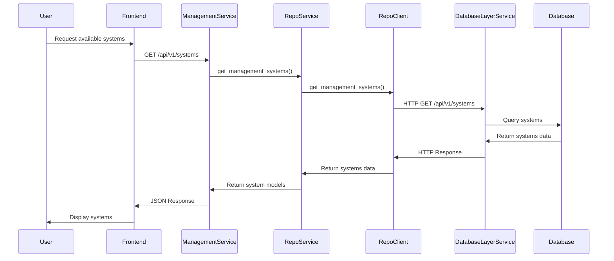
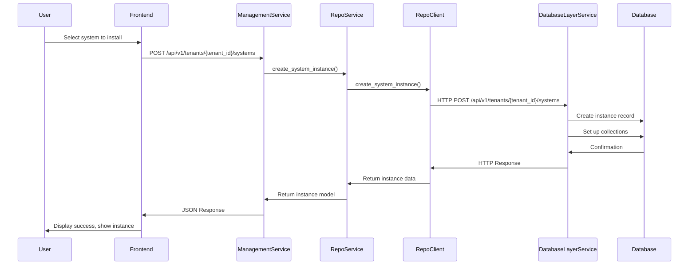
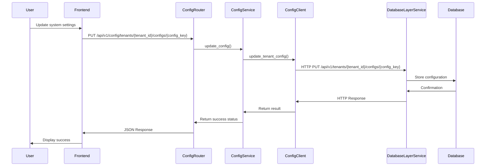

# System Synchronization and User Experience

This document provides an overview of how the Management Systems microservice ensures data synchronization across the system and explains the end-user experience of interacting with management systems.

## System Synchronization

The Management Systems microservice communicates with database layer services using a MACH architecture approach. This ensures that all systems remain in sync through several key mechanisms:

### 1. Consistent API Contract

- The database layer services provide consistent API contracts that the management systems microservice relies on
- All services communicate through well-defined REST APIs with standardized response formats
- Versioned APIs ensure backward compatibility during system updates
- Service clients abstract the communication details, providing a uniform interface

```python
# Example of standardized API client call
system_data = await client.get_management_system(system_id)
```

### 2. Cache Synchronization

- The management service uses Redis caching for performance optimization
- Cache invalidation is triggered when data changes:

```python
# Example from update_system_instance()
if success:
    # Invalidate caches
    await cache.delete(f"tenant:{tenant_id}:instance:{instance_id}")
    await cache.delete(f"tenant:{tenant_id}:systems")
    logger.debug(f"Cache invalidated for instance {instance_id}, tenant {tenant_id}")
```

- Time-to-live (TTL) values are set for different types of cached data in the `CacheConfig` class:

```python
class CacheConfig:
    """Cache configuration for management systems."""
    SYSTEM_DEF_TTL = 3600  # 1 hour
    INSTANCE_TTL = 300  # 5 minutes
    DATA_TTL = 60  # 1 minute
    USER_PERMISSIONS_TTL = 300  # 5 minutes
```

### 3. Transactional Operations

- Critical operations that modify multiple resources are handled atomically by the database layer services
- The database layer implements proper transaction handling for multi-step operations
- Error handling includes rollback mechanisms for consistency
- Operations like system installation ensure that all required resources are created consistently

### 4. Event-Based Communication

- For asynchronous updates, the system uses event-driven patterns
- The automation system dispatches events when data changes, enabling real-time updates
- Events are processed by the event dispatcher, which routes them to the appropriate handlers
- This ensures that changes propagate throughout the system in real-time

## Database Layer Integration

The Management Systems microservice communicates with databases exclusively through database layer services rather than direct connections:

```
Management Service → ManagementSystemRepoService → ManagementSystemRepoClient → management-system-repo service → MongoDB
```

This approach:
- Maintains separation of concerns
- Improves security by centralizing database access
- Creates consistency across all services
- Makes the system more maintainable and scalable

## User Experience of Management Systems

From a user's perspective, a management system presents a cohesive, integrated experience, hiding the complexity of the microservice architecture. Here's how users experience management systems:

### 1. Dashboard/Home View

- Upon login, users see a dashboard with their installed management systems
- Each system (CRM, Sales Automation, etc.) appears as a card or module
- Key metrics and summaries are visible at a glance
- Navigation sidebar for accessing different systems and functionalities

 <!-- Note: This is a placeholder, actual image would need to be created -->

### 2. System Navigation

- Clicking on a system (e.g., CRM) takes the user to that system's main interface
- Each system maintains its own navigation structure but with consistent design patterns
- System-specific search, filtering, and navigation options
- Consistent header and footer areas maintain the integrated experience

### 3. CRM System Example

- **Contact List View**:
  - Table of contacts with sortable columns
  - Search and filter options (e.g., filter by status, company, etc.)
  - Pagination controls with user-configured records per page
  - Action buttons for common operations (add, edit, delete)

- **Contact Detail View**:
  - Comprehensive contact information
  - Interaction history timeline
  - Related deals/opportunities
  - Custom fields configured by the tenant
  - Action buttons for specific operations (send email, schedule meeting)

- **Data Input Forms**:
  - Clean, intuitive forms for adding/editing contacts
  - Field validation based on system configuration
  - Custom fields appear based on tenant configuration

### 4. Sales Automation Example

- **Pipeline View**:
  - Visual Kanban-style board showing deals in different stages
  - Drag-and-drop functionality for moving deals between stages
  - Summary metrics for each pipeline stage (count, value)

- **Opportunity Detail View**:
  - Deal details including value, probability, contacts
  - Stage history with timestamps
  - Document attachments
  - Notes and activity log

### 5. Configuration Options

- Each system has its own settings page
- Users can customize:
  - Field configurations (add/remove/edit custom fields)
  - View layouts (which fields are visible, order)
  - Automation rules (trigger and action configurations)
  - Notification preferences
  - Integration settings with other systems

### 6. Cross-System Features

- **Global Search**: Search across all management systems
- **Notifications Center**: Central place for all system notifications
- **User Profile**: Manage user-specific settings
- **Admin Panel**: For tenant administrators to manage users, permissions, and system-wide settings

### 7. Mobile Responsiveness

- The interface adapts to different screen sizes
- Mobile-optimized views for common operations
- Touch-friendly controls for tablet users

## Data Flow for Key User Interactions

### Viewing Available Management Systems



### Installing a Management System



### Storing User Configurations



## Conclusion

The Management Systems microservice delivers a seamless, integrated user experience while maintaining a clean separation of concerns in the backend architecture. This approach provides the best of both worlds:

- **For users**: A cohesive, intuitive interface that behaves like a single integrated system
- **For developers**: A maintainable, scalable architecture following MACH principles

Through careful API design, caching strategies, and event-based communication, the system remains in sync while delivering high performance and reliability. 